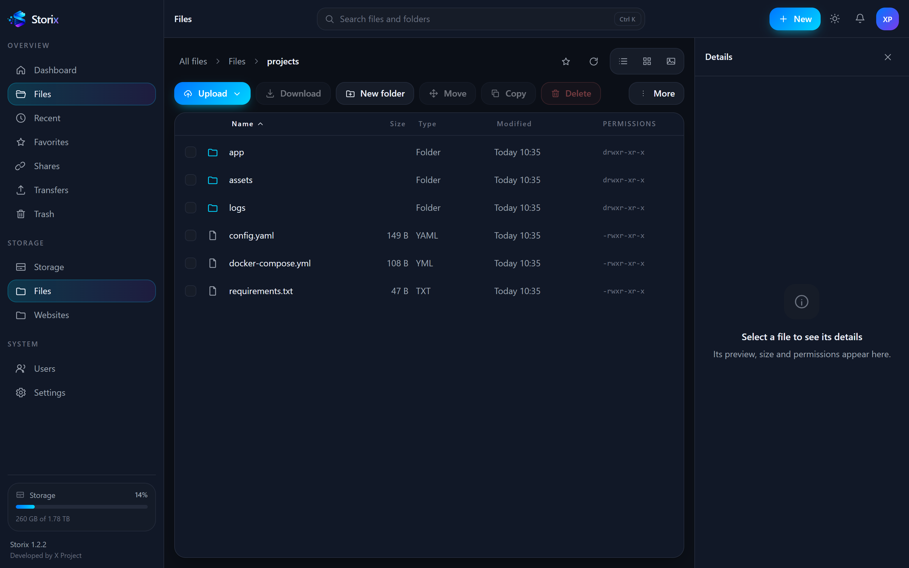
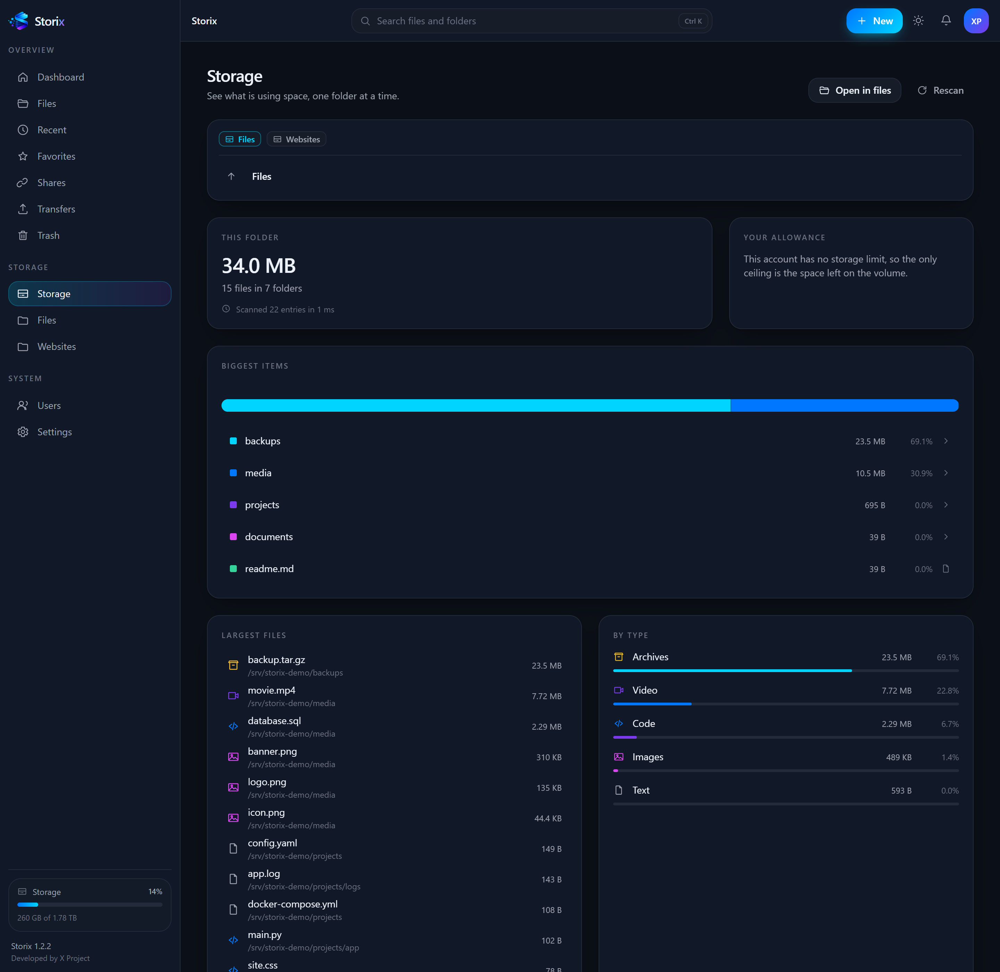
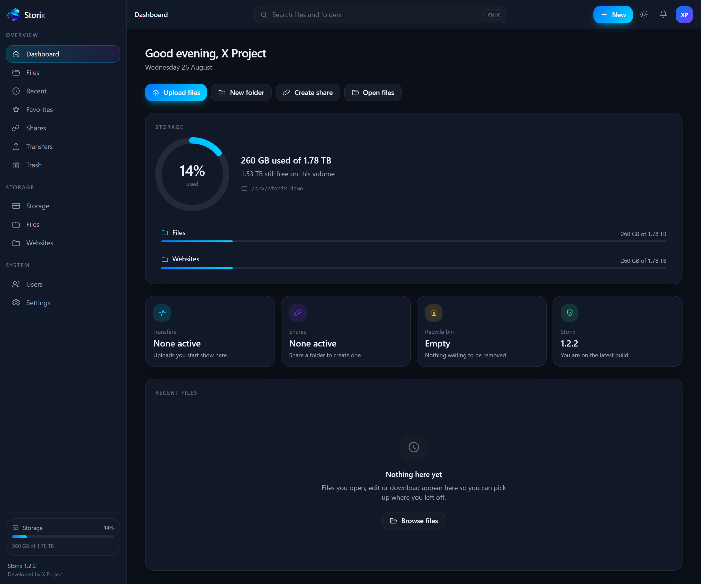
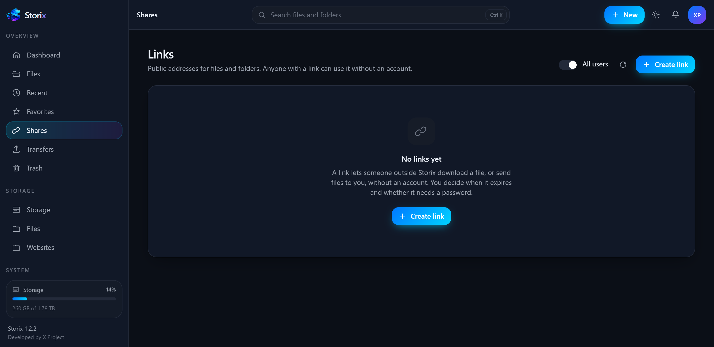
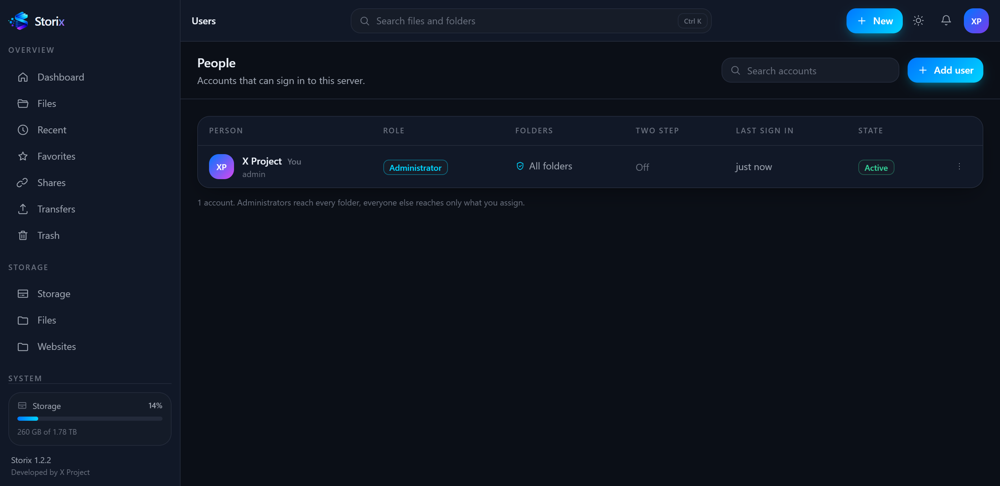
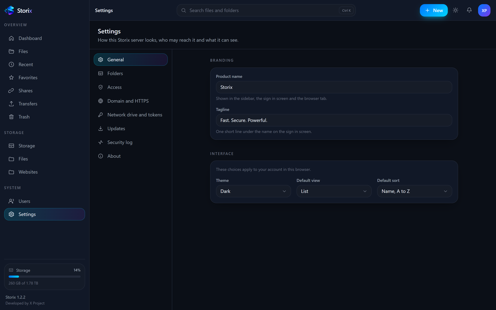

<p align="center">
  
</p>

<h1 align="center">Storix</h1>

<p align="center">
  <strong>Modern web file manager for servers.</strong><br>
  Browse, upload, edit and share server files from a browser or a mounted drive.
</p>

<p align="center">
  
  
  
  
</p>

---

Storix gives a server a real file manager in the browser. Upload an 80 GB backup
and have it survive a dropped connection, browse and preview files, edit a
config in place, hand a client a link to upload into one folder, and give a
colleague access to exactly one directory without ever creating an SSH account.

It is a single compiled binary. No PHP, no Node runtime on the server, no
database server, no web server to configure.

## Screenshots

<p align="center">
  
</p>

<p align="center">
  
</p>

<details>
<summary>More screens</summary>

<p align="center">
  <br>
  <em>The dashboard, with volume usage and recent files.</em>
</p>

<p align="center">
  <br>
  <em>Public links, with expiry, password and download limits.</em>
</p>

<p align="center">
  <br>
  <em>Accounts, each reaching only the folders it was given.</em>
</p>

<p align="center">
  <br>
  <em>Settings, where folders, access and the domain are managed.</em>
</p>

</details>

## Install

```bash
curl -fsSL https://raw.githubusercontent.com/XProject25/Storix/main/scripts/install.sh | sudo bash
```

The installer detects the distribution and architecture, installs the binary,
creates a service account, writes the configuration, registers a systemd
service, opens the firewall port and prints the link to the setup wizard.

```
  Storix  modern web file manager for servers
  Developed by X Project

  + Detected Ubuntu 24.04.1 LTS
  + Detected x86_64 (amd64)
  > Downloading Storix 1.2.0 for linux/amd64
  + Checksum verified
  > Creating the service account storix
  > Installing /usr/bin/storix
  > Writing /etc/storix/config.yaml
  > Registering the storix service
  > Opening port 8686 in the firewall
  > Starting Storix
  + Storix is running

  Storix 1.2.0 is installed

  Open this link to finish the setup:

    http://185.12.34.56:8686/setup?token=cJN6n8IF4O6D4bINJA7yPY
```

Open the link and a four step wizard asks for an administrator username and
password, which folders Storix may manage, and optionally a domain. Nothing
else.

## What it does

| | |
| --- | --- |
| **Transfers that survive** | Resumable uploads over the tus protocol. An 80 GB transfer that drops at 79 GB continues at 79 GB, not from zero. Pause, resume, parallel uploads, whole folders, a live queue with speed and time remaining. |
| **A real file manager** | Drag and drop, multi select, cut, copy, paste, rename in place, right click menus, keyboard shortcuts, list, grid and gallery views, breadcrumbs, search, sorting, favourites, recent files. |
| **Preview without downloading** | Images, video with seeking, audio, PDF, and text, logs, JSON, YAML, Markdown and source code with highlighting. Markdown is shown as text, not rendered. Zip and tar archives list their contents without being extracted. |
| **Edit in the browser** | A full editor with syntax highlighting for configuration files and scripts. Open, change, save. |
| **A recycle bin** | Deleting in the browser moves to the bin first, with restore, and automatic clean up after a retention period you choose. A delete through the network drive is immediate. |
| **Duplicate files** | Find identical copies under any folder and reclaim the space. Candidates are grouped by size first and only then compared by content, so nothing that merely looks the same is ever offered for deletion. |
| **Archives** | Create zip, tar.gz and tar archives, and extract those plus tar.bz2, as background jobs with progress. No SSH needed. |
| **Share links** | Publish a file or a folder with an expiry, a password and a download limit. Or create an upload request so a client can send you files without an account. |
| **Accounts without SSH** | Give someone exactly one folder, read only or writable, with a permission set. They never receive server credentials. |
| **A network drive** | Mount Storix in Windows Explorer, the macOS Finder or a Linux file manager, and work with server files as if they were on the machine in front of you. |
| **Access tokens** | Scriptable access for backups, rclone and continuous integration. A token is revoked on its own, without changing the account password or signing anybody out. |
| **Plain language** | The permission dialog asks who can access this, not what the octal mode is. Owner, group and mode bits live behind an Advanced disclosure for the people who want them. |
| **Updates in place** | The interface reports a new version and installs it, or you run `sudo storix update`. |
| **Automatic HTTPS** | Point a domain at the server, type it into settings, and a certificate is issued and renewed for you. |

## Mount it as a drive

Storix speaks WebDAV at `/dav/`, so the same folders open in the file manager
you already use. Settings, Access tokens shows these three lines filled in with
your own address and username:

```bash
# Windows, in a command prompt
net use Z: http://SERVER:8686/dav/ /user:alice <token>

# macOS, in Finder press Command K, enter the address, then sign in as alice
http://SERVER:8686/dav/

# Linux, as root
mount -t davfs http://SERVER:8686/dav/ /mnt/storix
```

Sign in with your username and an access token as the password. The account
password also works, unless the account uses two factor sign in, but a token
can be revoked on its own without changing it.

Windows refuses a WebDAV mount over plain HTTP until a registry value is
changed, so set up HTTPS first if you can. The full instructions, including
rclone and what a mount does not do, are in [docs/WEBDAV.md](docs/WEBDAV.md).

## How it works

One Go binary serves the JSON API under `/api/v1`, the WebDAV tree under
`/dav/`, and the web interface embedded inside it. Everything it keeps of its
own lives in five places:

```
/usr/bin/storix              the whole product
/etc/storix/config.yaml      configuration
/var/lib/storix/storix.db    accounts, shares, jobs, settings
/var/lib/storix/trash        the recycle bin
/var/log/storix/storix.log   log file
```

Storix never copies your data anywhere. It reads and writes the folders you
add, exactly where they already are.

## Security

Storix has access to server files, so the guard rails are the design, not an
afterthought.

- **Kernel enforced containment.** Every path resolves against the mounts the
  signed in account owns, and all file access then runs through `os.Root`,
  which pins operations below that directory at the syscall level. A symlink
  that points outside a mount cannot be followed, including one swapped in
  during an operation.
- **An allowlist, not a block list.** Non administrators see only the folders
  an administrator granted them. There is no path they can type to reach
  anything else.
- **Protected locations.** `/etc/shadow`, `/root/.ssh`, `/proc`, `/sys` and the
  Storix data directory are refused even when a parent folder is mounted.
- **Argon2id** password hashing, sessions stored as hashes, CSRF double submit
  tokens, login rate limiting with account lockout, and optional TOTP two
  factor authentication.
- **A dedicated service account.** The installer runs Storix as `storix`, not
  as root. The binary itself stays root owned, so a compromised service cannot
  rewrite it.
- **Hardened responses.** Downloads are served with `nosniff` and a sandbox
  content policy, so an HTML file stored on your server can never execute in
  the Storix origin.
- **An audit log** of every sign in, permission change, share and delete.

Reviewing this yourself is welcome: the guarded layer is `internal/vfs`, and
`internal/auth` holds the credential handling.

## Configuration

`/etc/storix/config.yaml`. Everything has a working default and most settings
are editable in the interface.

```yaml
server:
  host: 0.0.0.0
  port: 8686
  domain: ""            # set this and switch tls.mode to acme for HTTPS
  tls:
    mode: "off"         # off, acme or manual
    email: ""

storage:
  data_dir: /var/lib/storix

security:
  session_ttl: 168h
  allow_advanced: true  # show Unix owner and mode controls
  login_rate_burst: 8
  login_lockout: 15m
  denied_paths:
    - /etc/shadow
    - /root/.ssh

limits:
  max_upload_size: 0    # 0 means no limit
  upload_chunk_size: 16777216
  trash_retention: 720h

log:
  level: info
  file: /var/log/storix/storix.log
```

## Command line

```
storix serve            run the server, this is what the service does
storix version          version, commit and platform
storix user list        show the accounts
storix user add NAME    create an account, with -role and -mount
storix user passwd NAME change a password and end that user sessions
storix setup-token      print the first run link again
storix update           download and install the newest release
storix doctor           check the installation and report problems
storix config           show the effective configuration
```

`storix doctor` is the first thing to run when something is off. It checks the
configuration, the database, the data directory, the port, the administrator
accounts and every mounted folder.

## Access to folders

Storix runs as the `storix` account, so it reaches what that account can read.
If you add a folder and it appears empty, grant access:

```bash
sudo setfacl -R -m u:storix:rwx /var/www
sudo setfacl -R -d -m u:storix:rwx /var/www   # applies to new files too
```

Or add the account to a group that already has access:

```bash
sudo usermod -aG www-data storix && sudo systemctl restart storix
```

If you would rather Storix reach everything, install it with `--user root` and
accept that trade off knowingly.

## Building from source

Go 1.25 or newer and Node 20 or newer.

```bash
git clone https://github.com/XProject25/Storix.git
cd Storix
make build           # builds the interface, then embeds it in the binary
sudo make install    # installs it and registers the service
```

Development, with hot reload on the interface:

```bash
make dev             # API on :8686, interface on :5173
```

Checks:

```bash
make check           # go vet, go test, TypeScript
make release         # cross compiles linux amd64, arm64 and arm with checksums
```

## Updating

From the interface: Settings, Updates, Install. From the shell:

```bash
sudo storix update
sudo systemctl restart storix
```

Updates replace the binary and the interface only. Accounts, settings, shares
and mounted folders are kept.

## Removing it

```bash
curl -fsSL https://raw.githubusercontent.com/XProject25/Storix/main/scripts/uninstall.sh | sudo bash
```

Add `--purge` to remove the database and settings as well. Your files are never
touched either way.

## Roadmap

Storix 1.x manages the local file system. Remote storage is next: SFTP, FTP,
WebDAV, SMB, S3, Cloudflare R2, Backblaze B2 and the consumer drives, so a file
can be dragged from one storage to another in the same window.

## License

MIT. See [LICENSE](LICENSE).

---

<p align="center">
  <sub>Developed by X Project</sub>
</p>
